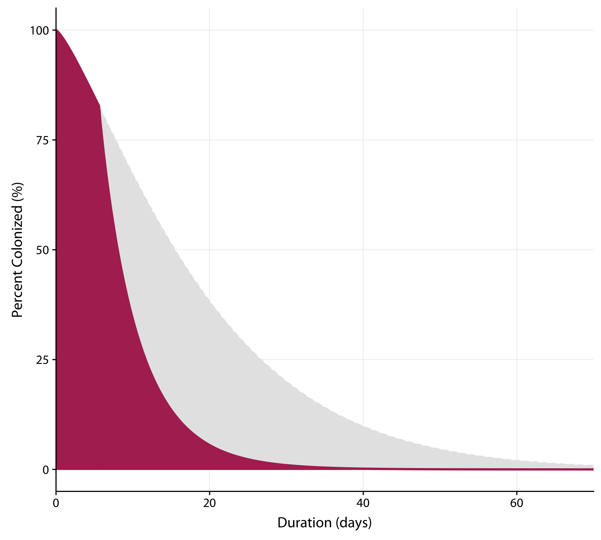

```{r loadpkg, results='hide', message=FALSE, warning=FALSE, echo=FALSE}
library(reshape2)
library(ggplot2)
library(dplyr)
library(gridExtra)
library(knitr)
library(ggbeeswarm)
library(cowplot)
library(ggpubr)
library(grid)
library(latex2exp)
library(knitr)
library(kableExtra)
if(!require(devtools)) install.packages("devtools")
devtools::install_github("kassambara/ggpubr")
```

\small{
\begin{center}
\begin{tabular}{|l l l| }
\hline
\textbf{Parameter} & \textbf{Definition} & \textbf{Estimate}\\
\hline
 & \textbf{Vaccination} & \\
 VE & Vaccine effectiveness & 3 doses are 87.2\% \\
 $p$ & Proportion of the infected population experiencing symptomatic disease & varies by outbreak\\
 $p_k$ & Proportion symptomatic after recieving $k$ doses of the vaccine & $p_0 = 0.69$, $p_{1,2} = 0.52$,\\
 & &  $p_3 = 0.12$\\
 $V_k$ & Proportion recieving $k$ doses of vaccine & varies by outbreak\\
 $r$ & Reported vaccination coverage among incompletely or unvaccinated individuals & varies by outbreak\\
 & in the population & \\
 & \textbf{Relative transmissibility} & \\
 $X$ & Ratio of the number of secondary infections from a symptomatic case to the number & 4.3\\
 &  of secondary infections from an asymptomatic carrier &  \\
 $\beta_S$ & measure of daily infectiousness for symptomatic cases  & \\
 $\beta_A$ & measure of daily infectiousness for asymptomatic carriers & \\
 $\tau$ & Relative infectiousness of asymptomatic individuals & 0.24 \\
 $\delta$ & Relative infectiousness of treated symptomatic cases & 0.49 \\
 &  \textbf{Duration of infection} & \\
 $g(t)$ & Proportion of untreated infections still infectious $t$ days later & \\
 $g_{T}(t)$ & Proportion of treated cases still infectious $t$ days later & \\
 $T(t)$ & Proportion of treated cases still infectious $t$ days after treatment & \\
 & \textbf{Reproductive numbers} & \\
 $R_0$ & Basic reproductive number & 2.44 \\
 $R$ & Effective reproductive number & varies by outbreak\\
 $R_S$  & The reproductive number for untreated, symptomatic cases & 3.19 \\
 $R_A$ & The reproductive number for asymptomatic carriers & 0.76 \\
  $\tilde{R_S}$ & The reproductive number for symptomatic cases where some proportion are treated & varies by outbreak\\
 $R_T$ & The reproductive number for treated, symptomatic cases & 1.56 \\
 $R_{3d}$ & The reproductive number for individuals fully vaccinated (3 doses) & 1.05\\
 $R_{3d}$ & The reproductive number for individuals never vaccinated (0 doses) & 2.44\\
 & \textbf{Intervention} & \\
 $\alpha$ & Proportion of symptomatic cases that are treated & varies by outbreak \\
 $x$ & the proportion of symptomatic infections that are not treated & varies by outbreak \\
 $V_c$ & Critical vaccination threshold in an untreated population & varies by outbreak\\
 $V_{c,T}$ & Critical vaccination threshold in an treated population & varies by outbreak\\
 $x$ & The proportion of symptomatic cases that need to be treated to reduce R below 1 & varies by outbreak\\
 \hline
\end{tabular}
\end{center}
}

# Clinical Course and Natural History

## Proportion Asymptomatic, $p_k$

To estimate the proportion of diphtheria infections who have been vaccinated $k$ times that are asymptomatic, we pooled data from all closed outbreaks (i.e., within schools) with information on the immunization status of all infections (2 studies).\cite{Miller_1972, Fanning_1947} We estimated the proportion of individuals who experience asymptomatic infection who have never received diphtheria vaccine $p_0$. 

To calculate  the proportion of individuals who experience asymptomatic infection with imperfect vaccination (1-2 doses), $p_{1,2}$ and the proportion of individuals who experience asymptomatic infection who have received full vaccination (3 doses), $p_3$, we use to the vaccine effectiveness. We know that the vaccine effectiveness is how effective the vaccine is at preventing symptoms relative to unvaccinated individuals. So we know that:

\begin{equation}
1 - \text{VE}_{3} = \frac{p_3}{p_0}
\end{equation}

Re-arranging, we solve for $p_3$ and find:

\begin{equation}
 p_3 = (1 - \text{VE}_{3})p_0
\end{equation}

likewise, given the vaccine effectiveness for incomplete vaccination, 

\begin{equation}
1 - \text{VE}_{1,2} = \frac{p_{1,2}}{p_0}
\end{equation}

Re-arranging, we solve for $p_{1,2}$ and find:

\begin{equation}
 p_{1,2} = (1 - \text{VE}_{1,2})p_0
\end{equation}

We estimate $p_3$ and $p_{1,2}$ within the same hierarchical Bayesian framework used to estimate $R_0$.

# Epidemiology 

## Proportion of Secondary Cases caused by Asymptomatic Individuals, $\tau$

To calculate the relative contribution of asymptomatic carriers over the course of infection, we first assume that given someone is colonized with diphtheria, the relative transmissibility is constant over time. Then, we write

\begin{equation}
X = \frac{\beta_S \int g(t)dt}{\beta_A \int g(t)dt}
\end{equation}

where $X$ is the relative number of secondary infections caused by symptomatic cases compared to asymptomatic carriers (Doull and Lara 1925 \cite{Doull_1925}); we estimated this to be $\frac{59/758}{14/779}$. $\beta_S$ and $\beta_A$ are measures of daily infectiousness for symptomatic cases and asymptomatic carriers, respectively; and $g(t)$ is the proportion of untreated infections still infectious $t$ days later. Since Doull and Lara 1925 \cite{Doull_1925} measured the number of secondary infections among household members, we also assume that the ratio of household infectiousness is equal to the ratio of overall infectiousness. 

We define $\tau := \beta_A/\beta_S$, thus, solving for $\tau$, we find

\begin{equation}
\tau = \frac{1}{X}
\end{equation}

We estimate $\tau$ using a Bayesian framework where the number of secondary infections from either symptomatic or asymptomatic infections were binomially distributed, with the number of contacts and the attack rates, calculated from Doull and Lara 1925 \cite{Doull_1925} passed in as data. 

## The Reproductive Numbers $R$ and $R_0$ 

To calculate the basic reproductive number, $R_0$, we first derive an equation to relate the effective reproductive number, $R$, to $R_0$. We estimated $R$ from multiple diphtheria outbreaks using the White and Pageno method which fits an exponential curve to estimate the early exponential growth of the epidemic. \cite{Forsberg_2008} We then use the derived quantities to solve for $R_0$.

### Derivation of the theoretical equation for the reproductive number, $R$
The reproductive number, $R$, is the average number of secondary infections from a single (average) infected individual in population with some level of existing immunity, such as from vaccination. To start with an “average” individual, we need to account for both symptomatic and asymptomatic transmission and treatment. We write $R$ as a weighted sum as follows:

\begin{equation}
R= \sum_{k=0}^3 (V_k)(p_k((1-\alpha)R_S + \alpha R_T) + (1-p_k)R_A)
\end{equation}

where $V_k$ is the proportion of the population recieving $k$ doses (such that $\sum V_k = 1$), $p_k$ is the proportion of the population which are symptomatic with $k$ doses of the diphtheria vaccine, $R_S$ is the average number of infections caused by a single infected symptomatic case in an otherwise totally susceptible population (the symptomatic reproduction number), $R_T$ is the average number of secondary infections caused by a single infected, treated symptomatic cases in an otherwise totally susceptible population, $R_A$ is the analogous term for untreated asymptomatic infections, and $\alpha$ is the proportion treated.

### Estimating the reproductive number from data

We estimated the reproductive number from 23 outbreaks for which daily or weekly case counts were available, using an adaptation of previously described methods, which simultaneously estimate $R$ and the serial interval for each individual outbreak.\cite{Forsberg_2008} For outbreaks in which case count data were aggregated by week, daily incidence was estimated by fitting a spline to the cumulative density function to produce probabilities for each day of each week. Using these probabilities, daily cases were imputed. Using \texttt{Stan} and \texttt{R}, we implemented these methods in a hierarchical Bayesian framework to estimate a global distribution for the serial interval and a global $R_0$. To accomplish this, we adjusted outbreak-specific $R$ estimates for diphtheria-specific dynamics (detailed below) to calculate an individual $R_0$ for each outbreak, and used these to inform a common distribution for $R_0$. 

To estimate $R_S$ (and thus solve for $R_0$), we first estimated the parameters needed in Eq. 7. This includes the proportion of the population vaccinated with 0, 1 or 2, or 3 doses. We estimated $V_k$ from three forms of available data: reported vaccination coverage for the population (reported from the paper), reported vaccination among cases, or estimated vaccination coverage from the WHO (for country level outbreaks). We excluded outbreaks where none of these data were available.

For studies which only reported the vaccination among cases, we calculated the population-level vaccination coverage using used our estimates for proportion symptomatic for each vaccination dose group ($p_k$).

For for early studies prior to the existence of the 3-dose primary vaccination series, we estimated the proportion recieving $0$ or $1-2$ doses ($V_0$ and $V_{1,2}$) using the following system of equations: 

\begin{align}
r &= \frac{p_{1,2} V_{1,2}}{p_{1,2} V_{1,2} + p_0(1-V_{1,2})}\\
1 & = V_0 + V_{1,2}
\end{align}

Where $r$ is the reported vaccination coverage among incompletely or unvaccinated individuals in the population, $V_0$ is the proportion of the population with $0$ doses, and $V_{1,2}$ is the proportion of the population with $1-2$ doses of the vaccine.

For studies from the three-dose vaccine series era, we can estimate these proportions when the population coverage with DTP3 is reported but incomplete or unvaccinated proportions are not reported. We use Eq. 6 again, with the following change:
\begin{align}
1 & = V_0 + V_{1,2} + V_3
\end{align}

Where $V_3$ is known. We then passed these estimates in as prior means, assuming each $V_k$ is normally distributed around the mean with a standard deviation of 10% of the mean. Prior mean and standard deviations were passed passed in for $p_0$ based on our calculation. Likewise a prior mean and standard deviation were passed in for both VE$_{1,2}$ and VE$_3$.

Using the estimated $R$, $V_k$, and $p_k$ values, we can re-arrange Eq. 7 to solve for $R_S$

\begin{align}
R &= \sum_{k=0}^3 (V_k)(p_k R_S + (1-p_k)R_A)\\
R &= (V_0 p_0 + V_{1,2} p_{1,2} + V_3 p_3 + V_0\tau(1-p_0) + V_{1,2}\tau(1-p_{1,2}) + V_3\tau(1-p_3))R_S
\end{align}

Solving for $R_S$ we find: 
\begin{equation}
R_S = \frac{R}{V_0 p_0 + V_{1,2} p_{1,2} + V_3 p_3 + V_0\tau(1-p_0) + V_{1,2}\tau(1-p_{1,2}) + V_3\tau(1-p_3)}
\end{equation}

Which we then use this equation to estimate $R_s$ using a hierarchical Bayesian framework, sampling from the parameter distributions of $V_k$, $p_0$, $p_{1,2}$, $p_3$, and $\tau$.

## The Basic Reproductive Number, $R_0$

The basic reproductive number assumes a completely immunologically naive population. To calculate $R_0$, we adapt our equation for $R$ by assuming $V_0=1$ (i.e., a totally susceptible population, thus $V_{1,2}=0$ & $V_3=0$), and find: 

\begin{align}
R_0 &= V_0 (p_0 R_S + (1-p_0) R_A)\\
&= p_0 R_S + (1-p_0) R_A
\end{align}

From this equation, we estimate $R_0$ in a bayesian hierarchical framework, sampling from the parameter distributions of $R_S$, $p_0$, and $\tau$.

## Sensitivity Analysis: Variability of Vaccination Coverage Estimates

For our initial estimation of $R_0$ from outbreak data, we wanted to allow the model to have flexibility in the vaccination coverage parameter. As such, for each outbreak we input priors for the mean vaccination coverage of 0, 1-2, and 3 or more doses, and we allow individual sampling distributions for coverages with each dose to follow a normal distribution with a standard deviation equivalent to the standard across all outbreaks for that dose, normalized by the mean for the outbreak ($sd_m = CoV*\mu_m$). As a result, the posterior distributions for the $V$ parameters were broad. In order to not completely throw out the information we had on vaccination coverage, we conducted a we conducted a sensitivity analysis restricting the standard deviations of the sampling distributions to 10% of the means. As a result, $V_c$ was reduced by 1.8\% and $R_0$ by 12.3\%. To maintain a balance between allowing the model to freely estimate the parameters and maximizing the data that we have, we use the estimates from the restricted variance model for our final calculations.

# Diphtheria Control and Outbreak Response 

## Critical Vaccination Threshold, $V_c$

To determine the critical vaccination threshold, we first determine what proprtion of the population needs to have recieved three doses of diphtheria vaccine ($V_3$) to achieve herd immunity. For the critical vaccination threshold, we assume that individuals either have full vaccination or no vaccination, so we can re-write Eq. 7 as: 

\begin{align}
R &= V_0(p_0 R_S + (1-p_0)R_A) + V_3(p_3 R_S + (1-p_3)R_A)\\
\end{align}

To achieve herd immunity, we want to estimate $V_3$ when $R<1$, so we solve for $V_3$: 

\begin{align}
1 &> V_0(p_0 R_S + \tau(1-p_0)R_S) + V_3(p_3 R_S + \tau(1-p_3)R_S) \\
\end{align}

Thus, the critical vaccination threshold is:

\begin{equation}
V_c = \frac{1-p_0R_S - \tau R_S + p_0\tau R_S}{(p_0 - p_3)R_S(\tau-1)}
\end{equation}

We then estimate $V_c$ within the same hierarchial Bayesian framework used to estimate $R_0$, sampling from the parameter distributions of $p_0$, $p_3$, $\tau$, and $R_S$.

## Proportion reduction in transmission from vaccination 
To determined by what proportion three doses of diphtheria vaccine reduces transmission, we calculate the reproductive number for fully vaccinated individuals, $R_{3d}$, and the reproductive number of never vaccinated individuals, $R_{0d}$, and take the ratio. 

We define $R_{3d}$ as:
\begin{equation}
R_{3d} = p_3R_S + (1-p_3)\tau R_S
\end{equation}

and $R_{0d}$ as:
\begin{equation}
R_{0d} = p_0R_S + (1-p_0)\tau R_S
\end{equation}

Thus the ratio is: 
\begin{align}
\frac{p_3R_S + (1-p_3)\tau R_S}{p_0R_S + (1-p_0)\tau R_S}
\end{align}

Thus, we show that fully vaccinated individuals cause 69\% fewer secondary infections on average, over the course of their infection.


## Critical Vaccination Threshold with treatment, $V_{c,T}$
The critical vaccination threshold determines what proportion of the population needs to be vaccinated to stop the spread of diphtheria, however, this assumes no treatment. To adjust for antibiotic treatment, we assume that only symptomatic individuals are treated and thus we can adjust the reproductive number of symptomatic individuals, where

\begin{equation}
\tilde{R_S} = (1-\alpha)R_S + \alpha R_T
\end{equation}

$\tilde{R_S}$ is the reproductive number for symptomatic individuals assuming some proportion, $\alpha$, are treated  and $R_T$ is the reproductive number for treated, symptomatic individuals. \emph{Note:} we assume that asymptomatic individuals are not detected as cases and therefore are not treated.

We can then relate $R_T$ and $R_S$ as follows:

\begin{equation}
R_S = \delta R_T
\end{equation}

where $\delta$ is the relative infectiousness of treated individuals. To calculate $\delta$ we follow the process in Eq. 5, where

\begin{equation}
 \delta = \frac{\beta_S\int_0^{30} (\alpha g_T(t) + (1-\alpha)g(t))dt}{\beta_S\int_0^{30} g(t)dt}
\end{equation}

and $\delta = \beta_S/\beta_T$. We assume that $g_T(t)$ follows the distribution of carriage of untreated cases, $g(t)$, described in section 2.1, prior to treatment and $g(t)*T(t)$ after the initiation of treatment. From this equation, we estimate $\delta$ in our hierarchical Bayesian framework. From this, we find $\delta=0.49$.

Figure S8 shows the distribution $g_{T}(t)$ compared to $g(t)$ wfor a treatment delay of 5.9 days.\cite{Guthrie_1921, Webb_McFadden_1947, Zusman_1962, Lys_1890, Parry_1939, Kehr_1960, Milkborne_1908, Miller 1974, Beach_1955, Bixby_1948, Kocher_Siemsen_1946}    

```{r pressure, echo=FALSE, fig.cap="Clearance of C. diphtheriae in cases treated with antibiotics 2 days after developing characteristic symptoms, $g(t)$ for the first two days and $g(t)T(t)$ for the remainder of infection (maroon), and untreated symptomatic infections, $g(t) (grey). ", out.width = '50%'}

```

To calculate the critical vaccination threshold with treatment, $V_{c,T}$, we return to Eq. 17 where:

\begin{align}
R &= V_0(p_0\tilde{R_S} + (1-p_0)R_A) + V_3(p_3\tilde{R_S} + (1-p_3)R_A)
\end{align}

We set R<1 to find the critical vaccination threshold, and solve for $V_3$, knowing $V_0 = 1-V_3$:
\begin{align}
1 &> V_0(p_0\tilde{R_S} + (1-p_0)R_A) + V_3(p_3\tilde{R_S} + (1-p_3)R_A)
\end{align}

Thus, the critical vaccination threshold with treatment is is:

\begin{equation}
V_{c,T} = \frac{-1 +p_0R_S -p_0\alpha R_S + p_0\alpha\delta R_S - \tau R_S -p_0\tau R_S}{(p_0 - p_3)R_S(1-\alpha+\alpha\delta - \tau)}
 \end{equation}


## Isolation of Symptomatic Cases Only
In many cases, it is more practical to treat only symptomatic infections. To determine what proportion of symptomatic cases need to be isolated to halt transmission, we write
\begin{equation}
xp_0R_S + (1-p_0)R_A <1 
\end{equation}

Solving for $x$, we find
\begin{equation}
x =\frac{1- (1-p_0)R_A}{p_0R_S} 
\end{equation}

where $1-x$ is the proportion of symptomatic infections that are need to be treated.